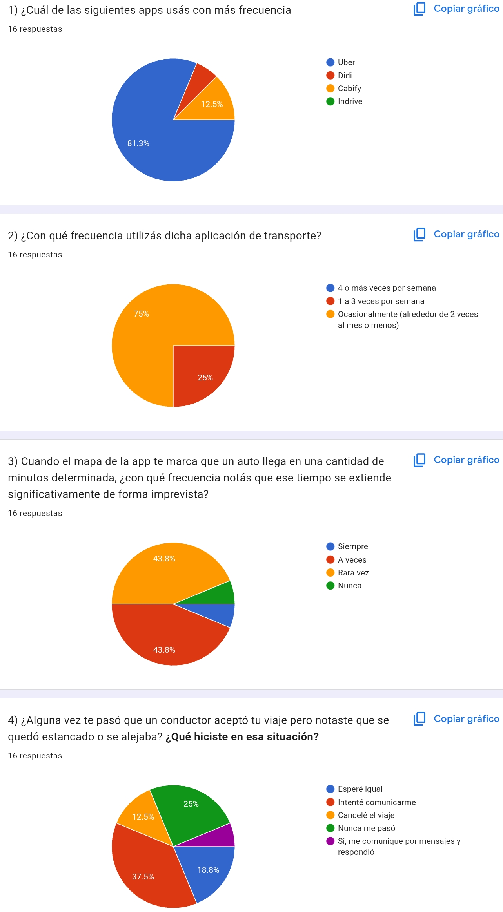
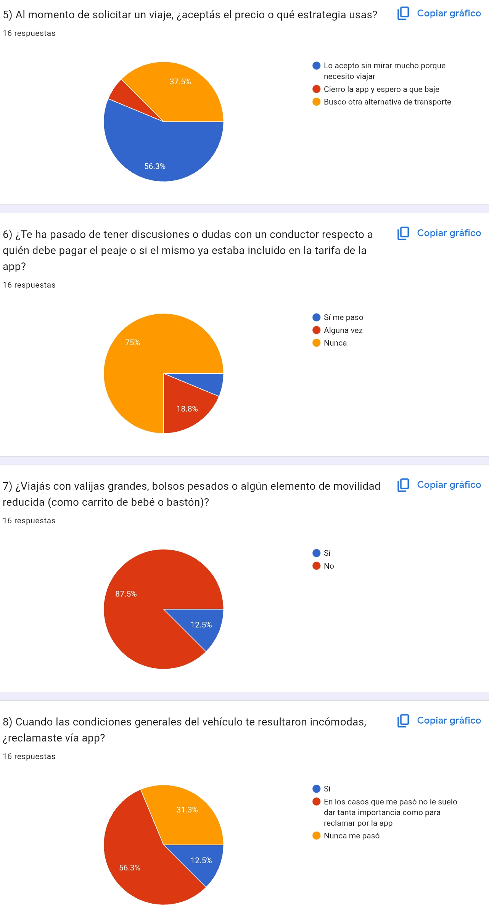
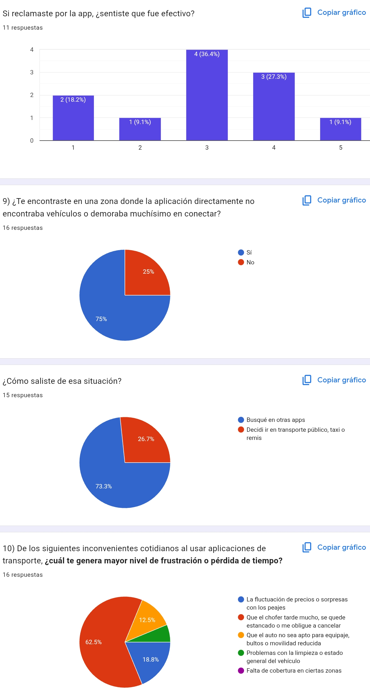
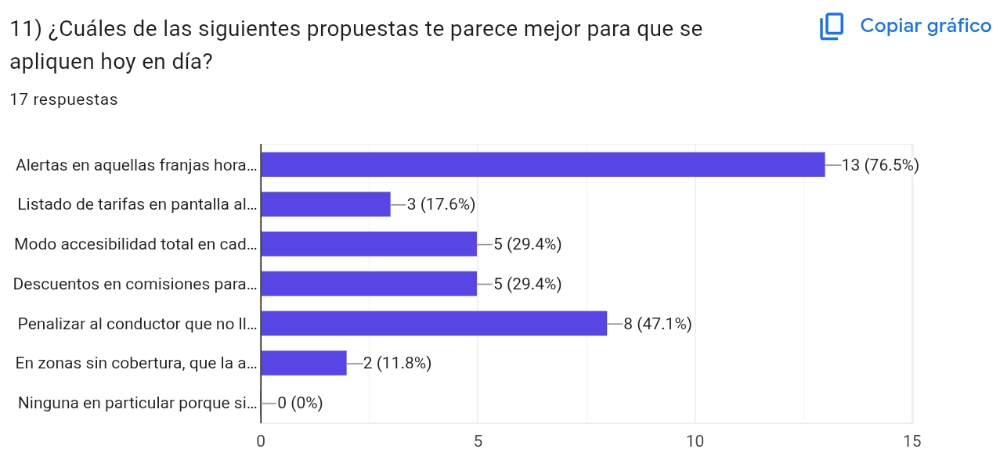

  

# UNIVERSIDAD DE BUENOS AIRES
## FACULTAD DE INGENIERÍA

  

### Ingeniería de Software 1
### Cátedra Montaldo

  

# Informe Brainstorming

  

### Alumno

Elías Josué Cuba Díaz 106933

---

## App elegida: Uber

### ¿Quiénes son sus usuarios?

Principalmente personas que necesitan transporte directo, rápido y seguro. También quienes quieren ofrecer el servicio y tener un ingreso extra.

### ¿Qué problema resuelve la app?

Proveer transporte en todo momento y en cualquier parte.

### ¿Qué funcionalidades principales tiene?

Conectar/comunicarse con un conductor, medios de pago, gps, identificación de conductor y usuario.

### ¿Qué cosas no funcionan tan bien o podrían mejorar?

- No poder encontrar conductor habiendo varios cerca de la zona.
- El precio puede fluctuar mucho.
- Es fácil crear una cuenta falsa. 
- El sistema no es claro con el peaje para ambas partes, no dejando en claro si ya viene incluido en el pasaje o no.
- Si la persona necesita llevar bulto o silla de infantes, ¿el vehiculo es apto?
-  Si el cliente tiene movilidad reducida, ¿el conductor está apto para asistirlo?
- Los reclamos sobre las condiciones del vehiculo suelen ser no efectivos.
- Pasado un cierto tiempo, si el chofer no llega, para evitar la penalización por cancelación, se queda deambulando hasta que el cliente cancele.
- A veces el autocompletado del destino marca otro punto pero no lejano.
- Hay ciertas zonas por fuera de cappital federal donde no llega la cobertura de la aplicación.

## Brainstorming de mejoras

- Alertas en aquellas franjas horarias que el precio sube y que también muestre cuando se encuentra en mínimos.
- Poder subir los precios voluntariamente de forma gradual
- Verficación biométrica obligatoria.
- Listado de tarifas en pantalla al momento de solicitar el viaje en lugar del precio final.
- Modo accesibilidad total en cada perfil de conductor.
- Que los conductores marquen al buscar viajes si tienen el baúl ocupado para que el cliente lo tenga en cuenta o no le aparezca dicho conductor.
- Descuentos en comisiones para los conductores que mantengan su puntaje de limpieza e higiene por arriba de 4.9 estrellas.
- Detectar choferes que no llegan a recoger al cliente, éste sea desasignado y que haya o bonificación al cliente o penalización al conductor.
- Un historial de destinos frecuentes inteligente para que aprenda según mi rutina, cuales serían mis destinos más probables. 
- En zonas sin cobertura, que la app permita pedir un viaje hacia terminales o remiserías locales.

## Mejor idea: Detectar choferes que no llegan a recoger al cliente

### ¿Qué problema resuelve?

Resuelve la situación en la que un conductor acepta un viaje pero no se dirige al punto de encuentro, especulando intencionalmente con que sea el pasajero quien cancele para así evitar la penalización por cancelar fuera de término. Esto elimina la incertidumbre de parte del cliente.

### ¿Para quién?

Para los clientes.

### ¿Por qué sería valiosa?

Permite a los pasajeros preveer para buscar otro conductor y evitar cobros indebidos por cancelaciones ajenas a su voluntad.

Mejora la eficiencia operativa, reduce la tasa de abandono de usuarios frustrados y frena una mala práctica que deteriora la confianza en el servicio haciendo que vayan a otras apps similares.

## Conclusión

  

  

El problema planteado es un problema que afecta a la gran mayoría de los usuarios según la encuesta (Pregunta 10). Por otro lado, dentro de las soluciones brindadas, la más elegida es saber cuando el viaje está a buen precio (Pregunta 11). Esto se puede ver en la Pregunta 5 que el público prefiere priorizar el factor precio en lugar del tiempo de espera.

Según la encuesta, en general, el público está dispuesto a sacrificar un poco de comodidad y tiempo en favor de ahorrar en el precio. Por tanto, sería más beneficioso pensar en brindar las estadísticas sobre los precios a lo largo del tiempo.